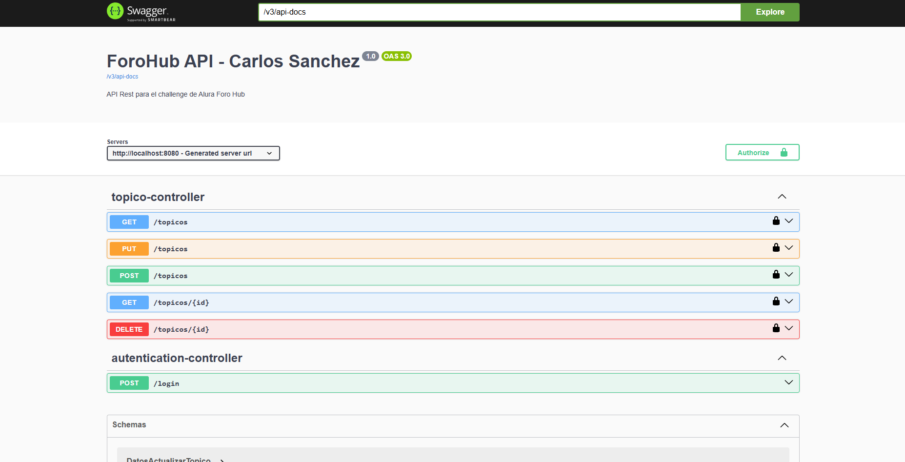

# ForoHub API 🚀 - Challenge Alura / Oracle Next Education

Este proyecto es una **API REST** robusta desarrollada como parte del Challenge de la formación Backend en el programa Oracle Next Education (ONE). El objetivo principal es replicar el backend de un foro, permitiendo la gestión de tópicos, usuarios y seguridad.

## 🛠️ Tecnologías y Herramientas
* **Java 21**: Utilizando las últimas funcionalidades como Records.
* **Spring Boot 3.2.5**: Framework principal para el desarrollo de la API.
* **Spring Security & JWT**: Implementación de autenticación y autorización basada en tokens stateless.
* **Spring Data JPA**: Para la persistencia de datos y comunicación con la DB.
* **MySQL**: Base de datos relacional para el almacenamiento de información.
* **Flyway**: Herramienta de migración de base de datos para control de versiones del esquema.
* **Lombok**: Para reducir el código repetitivo (Boilerplate).
* **SpringDoc OpenAPI (Swagger)**: Documentación interactiva de todos los endpoints.

## 📋 Funcionalidades
- **CRUD de Tópicos**: Registro, listado, actualización y eliminación lógica de mensajes.
- **Seguridad**: Solo usuarios autenticados pueden crear, editar o borrar tópicos.
- **Validaciones**: Uso de Bean Validation para asegurar la integridad de los datos de entrada.
- **Asociación Automática**: El autor de cada tópico se extrae automáticamente del token JWT del usuario logueado.
- **Tratamiento de Errores**: Respuestas personalizadas (400, 404, 403, 500) formateadas de manera amigable.

## 📖 Documentación de la API (Swagger)
Una vez ejecutado el proyecto, puedes acceder a la documentación interactiva en:
`http://localhost:8080/swagger-ui.html`

Desde allí, puedes probar los endpoints de autenticación y los métodos protegidos utilizando el botón **"Authorize"** con el token JWT generado.

## 🚀 Cómo ejecutar el proyecto
1.  Clona el repositorio.
2.  Configura las credenciales de tu base de datos MySQL en el archivo `src/main/resources/application.properties`.
3.  Ejecuta el comando `./mvnw clean install` para descargar las dependencias.
4.  Inicia la aplicación con `ForohubApplication.java`.
5.  Las tablas se crearán automáticamente gracias a Flyway.

---
Desarrollado por **Carlos Sanchez** - ¡Conectemos en [LinkedIn](www.linkedin.com/in/carlos-sanchez13)!