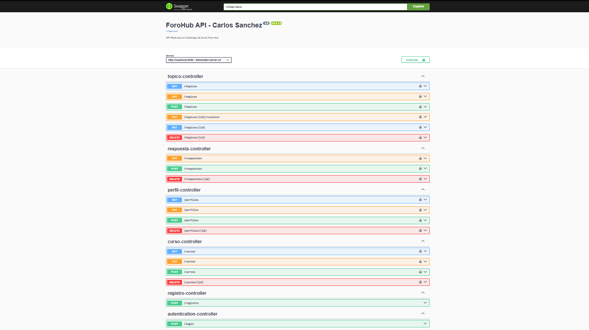

# ForoHub API 🚀 - Challenge Alura / Oracle Next Education

Este proyecto es una **API REST** robusta desarrollada como parte del Challenge de la formación Backend en el programa Oracle Next Education (ONE). El objetivo principal es replicar el backend de un foro, permitiendo la gestión integral de tópicos, respuestas, usuarios y seguridad centralizada.

## 📋 Funcionalidades Implementadas

La API ha sido extendida para cubrir el ciclo de vida completo de una plataforma de discusión:

### 🔐 Seguridad y Usuarios
- **Registro Público (`POST /registro`)**: Endpoint abierto para que nuevos usuarios puedan crear su cuenta (ej: `pedro.sanchez`) sin necesidad de token previo.
- **Autenticación JWT**: Implementación de tokens stateless para sesiones seguras.
- **Asignación de Roles**: Los nuevos usuarios reciben automáticamente el perfil `ROLE_USER` al registrarse.
- **BCrypt Hashing**: Las contraseñas se almacenan encriptadas, garantizando la seguridad de los datos.

### 💬 Gestión de Tópicos y Respuestas
- **CRUD Completo de Tópicos**: Registro, listado paginado, actualización y eliminación lógica.
- **Visualización Anidada**: Al consultar un tópico por ID (`GET /topicos/{id}`), se devuelve el detalle completo incluyendo todas sus **respuestas asociadas**.
- **Resolución de Tópicos**: Endpoint específico para marcar un tópico como **"RESUELTO"**.
- **Gestión de Respuestas**: CRUD para mensajes, permitiendo editarlos, eliminarlos o marcarlos como la solución oficial.

### 📚 Administración de Cursos
- **Borrado Lógico**: Los cursos cuentan con un estado `activo`. Al eliminarlos, permanecen en la base de datos para no romper la integridad referencial de los tópicos históricos, pero dejan de mostrarse en los listados generales.
- **Actualización Dinámica**: Modificación de nombres y categorías de cursos existentes.

## 🛠️ Tecnologías y Herramientas
* **Java 21**: Uso de Records para DTOs y programación funcional con Streams.
* **Spring Boot 3.2.5**: Framework base para la construcción de microservicios.
* **Spring Security**: Control de acceso y filtros de autenticación.
* **Spring Data JPA & MySQL**: Persistencia de datos relacional y comunicación con la DB.
* **Flyway**: Control de versiones de la base de datos para asegurar un esquema consistente.
* **Lombok**: Reducción de código repetitivo (Boilerplate).
* **SpringDoc OpenAPI (Swagger)**: Documentación técnica interactiva de todos los endpoints.

## 📖 Documentación de la API (Swagger)
Una vez ejecutado el proyecto, puedes acceder a la documentación interactiva en:
`http://localhost:8080/swagger-ui.html`

> **Instrucciones para pruebas:**
> 1. Crea un usuario en el endpoint público `/registro`.
> 2. Obtén tu token JWT en el endpoint `/login`.
> 3. Haz clic en el botón **"Authorize"** en la parte superior de Swagger y pega el token generado.

## 🚀 Cómo ejecutar el proyecto
1.  Clona el repositorio.
2.  Configura las credenciales de tu base de datos MySQL en el archivo `src/main/resources/application.properties`.
3.  Asegúrate de tener instalado Java 21 y Maven.
4.  Ejecuta el comando `./mvnw clean install` para descargar las dependencias.
5.  Inicia la aplicación con `ForohubApplication.java`.
6.  Las tablas y perfiles base se crearán automáticamente gracias a las migraciones de Flyway.

---
Desarrollado por **Carlos Sanchez** - ¡Conectemos en [LinkedIn](https://www.linkedin.com/in/carlos-sanchez13)!